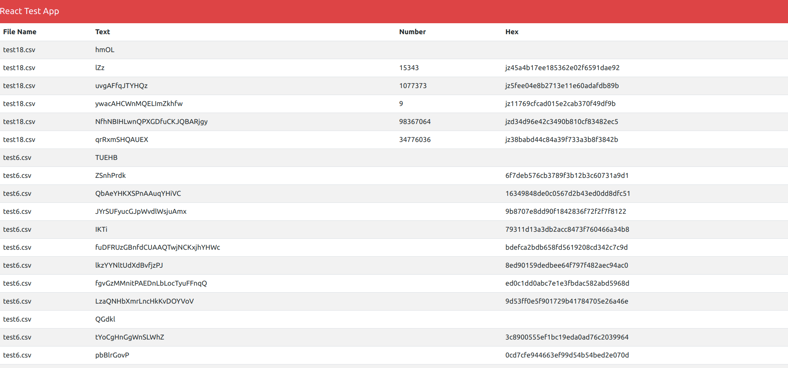

CSV parser API with a React-Redux dashboard




## Getting Started

First, run the API:

```bash
npm install

npm run dev
# or

```

Second, run the React App:


```bash
cd frontend

npm install

npm start
# or

```
## Test


```bash

npm run test
# or

```

## Built With
- Node.js
- React
- Redux
- Bootstrap
- Express
- Mocha
- Chai


## Authors

👤 **Pablo Alexis Zambrano Coral**
- Github: [@Alexoid1](https://github.com/Alexoid1)
- Twitter: [@Alexis Zambrano_acz](https://twitter.com/pablo_acz)
- Linkedin: [linkedin](https://www.linkedin.com/in/alexzambranocoral/)


